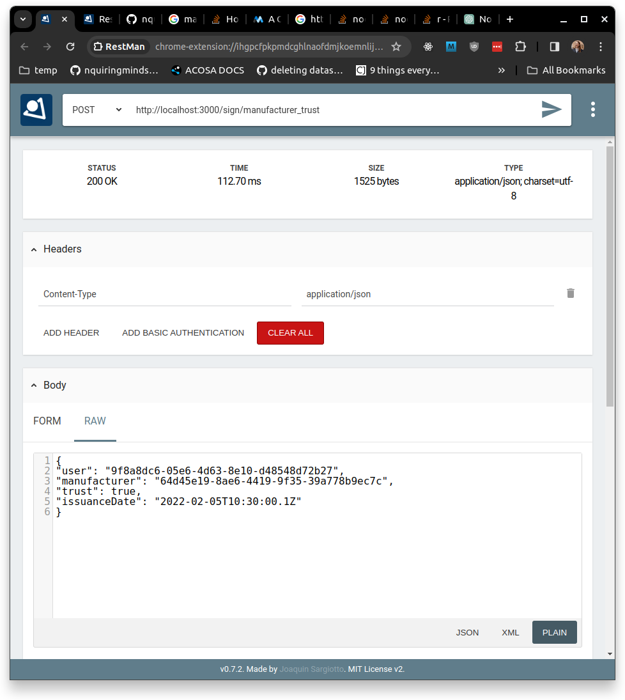
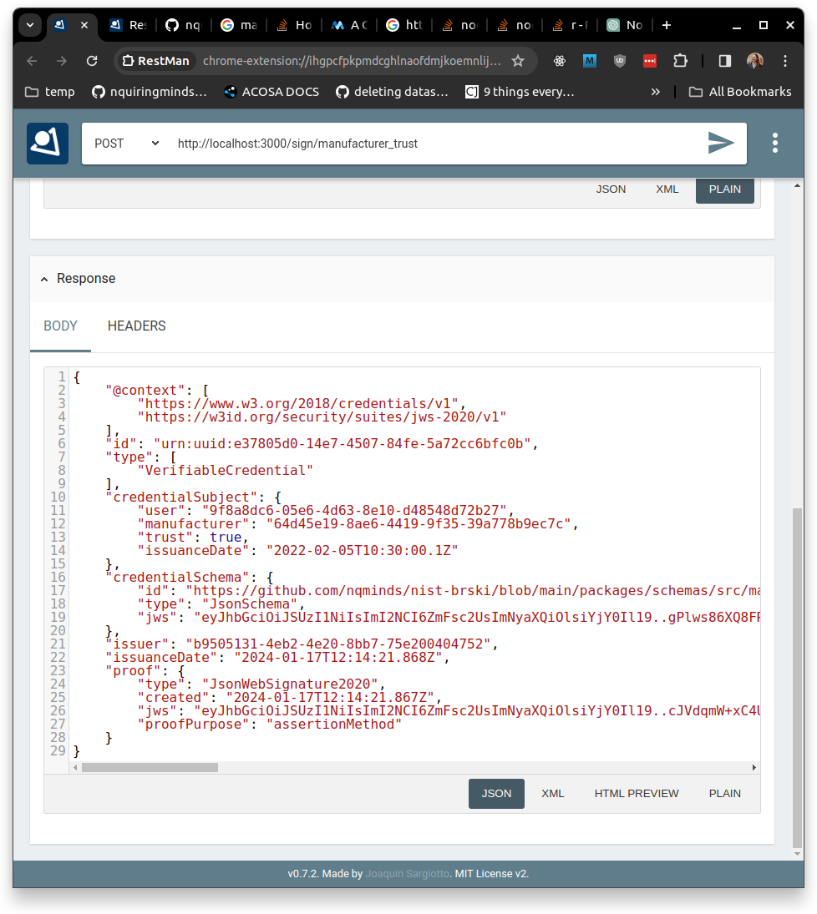
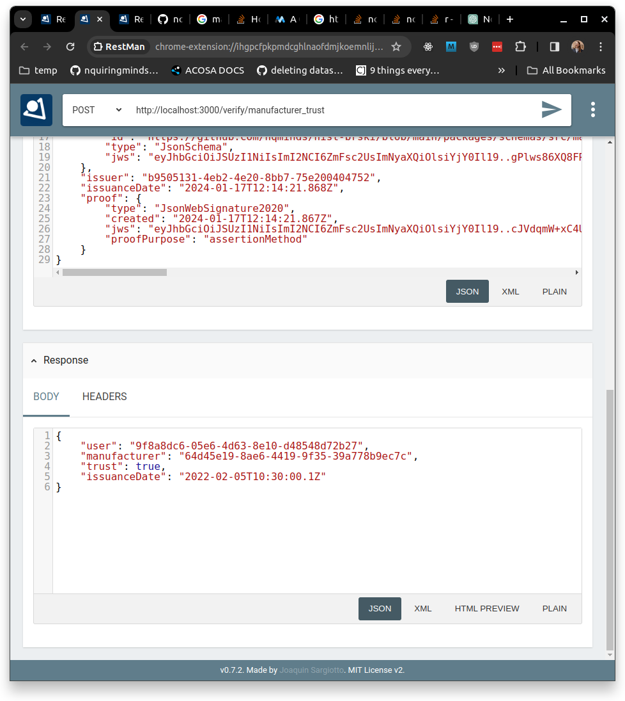
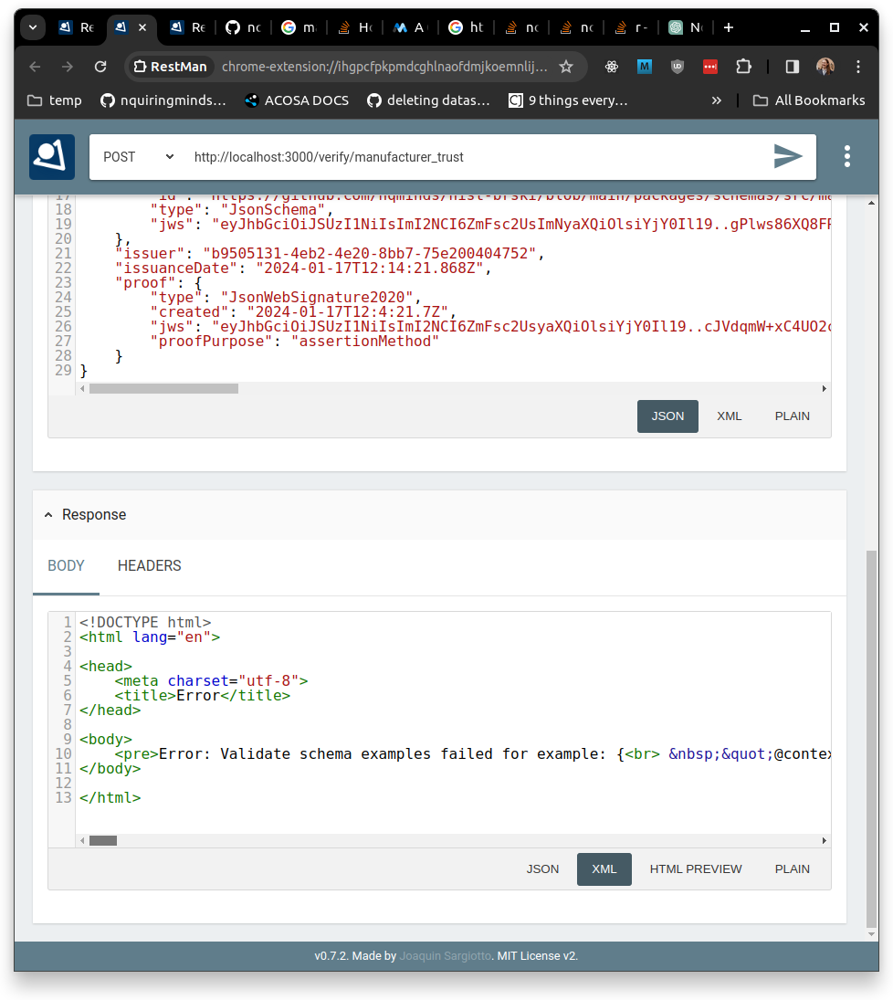

# NIST VC (Verifiable Credential) REST Server

Provides a REST API server with route to sign data matching schemas in @nqminds/nist-brski-schemas and return a VC and a route to verify a VC and return the data contained within it. No authentication has been added to the Rest API as it is intended to be used only locally and not exposed to external traffic.

After the @nqminds/nist-brski-schemas schemas have been instantiated on a volt running on the registrar a Rest API Instance can be started on the registrar which may be used to verify VCs received by the registrar.

A user / process that wishes to communicate information to the registrar must sign into the volt running on the registrar and export their config for the volt. They can then run an instance on the Rest API on their local machine and sign the data they wish to communicate as a VC which can then be communicated to the registrar. At present, only the config of the user who is the owner of the schemas may be used with the Rest API to sign and verify VCs.

## Setup

### Step 1
Follow the [instructions to populate a volt with the schemas and set it up for the VC toolchain](https://github.com/nqminds/nist-brski/blob/main/packages/schemas/README.md)

### Step 2
Copy the path to the `volt-config.json` used to populate the volt with the schemas into the `config.json` file.

### Step 3
Run the Rest API with `npm run dev`

## Usage

### Signing 
To sign a VC for a claim, make a post request to the Rest Server at route `{address}/sign/{schema_name}` with the body being a JSON claim corresponding to the VC schema you wish to use. The post request will respond with the VC in JSON format.

For example here I use the RestMan google chrome extension to sign a claim that a user trusts a manufacturer.

If I submit a VC body which does not conform to the schema then I will recieve a http response with the error:

### Verifying
To verify a VC, make a post request to the Rest Server at route `{address}/verify/{schema_name}` with the body being the VC corresponding to the VC schema used for the VC. If the VC verifies it will return the JSON body of the information signed in the VC.

For example here I verify the VC I generated in the previous example.

If I submit an invalid VC it returns with a http response of the error
